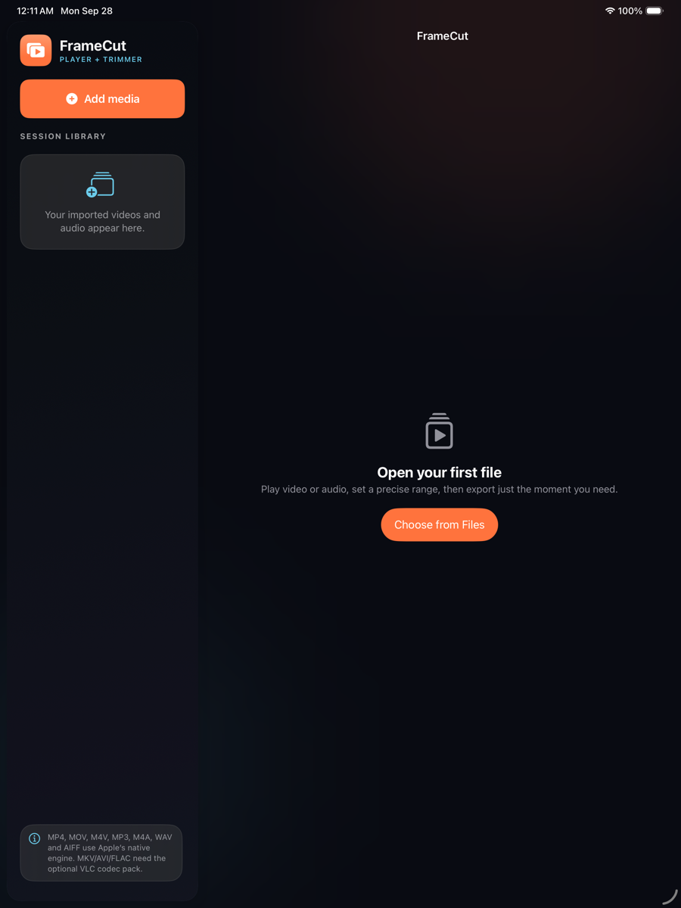

# FrameCut for iPad

FrameCut is an iPad-first video and audio player with an integrated precision trimmer. It is written in Swift and SwiftUI, uses AVFoundation for native playback and export, and is designed for the 8th-generation iPad and newer.



## What FrameCut does

### Media library and importing

- Imports multiple files from Files, iCloud Drive, external drives, and compatible document providers.
- Maintains a session library with separate video and audio identification.
- Keeps security-scoped file access active while imported media is in the library.
- Prevents duplicate imports and reports unsupported formats clearly.

### Playback

- Play and pause.
- Seek using the playback-position slider.
- Jump backward or forward by 10 seconds.
- Select 0.5x, 1x, 1.5x, or 2x playback speed.
- Mute or unmute.
- Adjust volume with a slider or dedicated volume-down and volume-up buttons.
- Select an AirPlay or audio output route.
- Open video in full screen while retaining playback controls.
- Use Picture in Picture where supported by the system.
- Switch among Fit, Fill, and Stretch presentation modes.

### Precision trimming

- Drag independent IN and OUT handles on the trimming timeline.
- Adjust either boundary in 0.1-second increments.
- Prevent the handles from crossing or creating an invalid clip.
- Reset the selection to the complete file.
- Preview the selected range.
- Loop the selected range during preview.
- Display both total duration and precise trim timecodes.
- Export video as high-quality MP4 or MOV and audio as M4A.
- Share an exported clip to Files, Photos, Messages, AirDrop, or another compatible app.

### iPad experience

- iPad-only target with responsive `NavigationSplitView` layouts.
- Supports portrait, upside-down portrait, landscape-left, and landscape-right.
- Adapts to Split View and different iPad sizes.
- Includes large touch targets and VoiceOver descriptions.
- Supports keyboard and trackpad input.
- Includes a custom FrameCut app icon and dark media-focused interface.

### Keyboard shortcuts

| Shortcut | Action |
| --- | --- |
| Command-O | Open the media importer |
| Space | Play or pause |
| Left Arrow | Jump backward 10 seconds |
| Right Arrow | Jump forward 10 seconds |
| M | Mute or unmute |

## Compatibility

| Item | Requirement |
| --- | --- |
| Development computer | A Mac capable of running Xcode |
| Xcode | Xcode 27 or newer recommended |
| Deployment target | iPadOS 18.0 or later |
| Physical hardware | Designed for iPad 8th generation and newer |
| Tested simulator | iPadOS 26.5 on iPad Pro 13-inch (M5) simulator |
| Language | Swift 6 |
| UI framework | SwiftUI |

The project targets only the iPad device family. It does not install on Android tablets, and it does not build an Android APK.

## Get the project

### Clone with Git

```bash
git clone https://github.com/Hari-Aditya-003/FrameCut-iPad.git
cd FrameCut-iPad
open FrameCut.xcodeproj
```

For a private repository, authenticate with the same GitHub account that has access to the project. You can also select **Code > Download ZIP** on GitHub, extract the archive, and open `FrameCut.xcodeproj`.

## Run in an iPad simulator

1. Open `FrameCut.xcodeproj` in Xcode.
2. Confirm that the active scheme is **FrameCut**.
3. Open the run-destination menu in the Xcode toolbar.
4. Choose an iPad simulator, such as **iPad (A16)** or **iPad Pro 13-inch**.
5. Press the triangular **Run** button or press Command-R.
6. When FrameCut opens, select **Choose from Files** to import compatible media available to the simulator.

The simulator is useful for interface testing, but playback performance, AirPlay, Picture in Picture, Files providers, and hardware behavior should also be tested on a real iPad.

## Install on a physical iPad

### 1. Add your Apple Account to Xcode

1. Open **Xcode > Settings > Accounts**.
2. Press the plus button if necessary.
3. Sign in with your Apple Account.

A free Apple Account is sufficient for personal device testing. Free Personal Team installations expire periodically and need to be rebuilt. TestFlight, Ad Hoc distribution, and App Store submission require an Apple Developer Program membership.

### 2. Connect and trust the iPad

1. Connect the unlocked iPad to the Mac with a USB cable.
2. Tap **Trust This Computer** on the iPad if it appears.
3. Enter the iPad passcode.
4. Wait until the iPad appears in Xcode's run-destination menu or Device Hub.

### 3. Enable Developer Mode

On the iPad, open:

**Settings > Privacy & Security > Developer Mode**

Turn Developer Mode on, allow the iPad to restart, tap **Turn On** after it restarts, and enter the passcode. Keep the iPad unlocked and connected while Xcode finishes preparing developer support.

### 4. Configure signing

1. Select the blue **FrameCut** project in Xcode's Project navigator.
2. Select the **FrameCut** target.
3. Open **Signing & Capabilities**.
4. Enable **Automatically manage signing**.
5. Select your Personal Team or paid Developer Team.
6. If the bundle identifier is unavailable, replace `com.framecut.ipad` with a unique value, for example `com.yourname.framecut`.

### 5. Build and install

1. Select the connected iPad as the run destination.
2. Press Command-R or click **Run**.
3. Wait for Xcode to build, sign, install, and launch FrameCut.
4. FrameCut will remain available from the iPad Home Screen or App Library.

If iPadOS displays an untrusted-developer warning, open **Settings > General > VPN & Device Management**, select the developer profile, and trust it.

## Using FrameCut

1. Tap **Add media** or **Choose from Files**.
2. Select one or more supported video or audio files.
3. Select an item from the session library.
4. Use the playback controls to review it.
5. Drag the orange IN and OUT handles to choose a range.
6. Use the minus and plus buttons for 0.1-second adjustments.
7. Enable the loop button if you want the selected range to repeat.
8. Tap **Preview** to review the trim.
9. Tap **Export** to render the selected range.
10. Tap **Share** to save or send the exported file.

Imported items remain in the library for the current app session. The original files are not modified. Every export creates a separate trimmed file.

## Media-format support

### Native formats

FrameCut uses Apple's AVFoundation engine. It recognizes these native file extensions:

- Video: MP4, MOV, M4V
- Audio: MP3, M4A, AAC, WAV, AIF, AIFF, CAF

Playback still depends on the audio/video codec stored inside the container. For example, an `.mp4` file can contain a codec that the installed iPadOS version does not decode.

### Formats requiring a VLC-compatible engine

FrameCut recognizes MKV, AVI, WebM, FLV, WMV, TS, MTS, M2TS, FLAC, OGG, Opus, and WMA as media that needs an expanded codec engine. The current repository does not bundle MobileVLCKit because that dependency is very large and requires separate licensing, binary-distribution, and App Store decisions.

When one of these files is imported, FrameCut reports that a VLC codec pack is required instead of failing silently. See `FEATURES.md` for the proposed expanded-codec roadmap.

## Tests and verification

The project includes Swift Testing suites for:

- Trim-range clamping.
- Minimum clip-length enforcement.
- Zero-duration media.
- Native and expanded-codec format classification.
- Normal and long-form timecodes.
- Invalid time values.
- Precise timecode rollover.

Run tests inside Xcode with **Product > Test** or Command-U.

For command-line testing, replace the destination with an installed simulator name if necessary:

```bash
xcodebuild test \
  -project FrameCut.xcodeproj \
  -scheme FrameCut \
  -destination 'platform=iOS Simulator,name=iPad (A16)'
```

The verified build passed:

- 11 test definitions.
- 17 parameterized test executions.
- Release static analysis.
- An unsigned Release build for a generic physical iPad destination.
- Installation and launch in an iPadOS 26.5 simulator.

Additional details are available in `VERIFICATION.md`.

## Project structure

```text
FrameCut.xcodeproj/             Xcode project and shared scheme
FrameCut/
  Assets.xcassets/             App icon and asset catalog
  Components/                  Reusable visual styling
  Editing/                     Trim model and AVFoundation exporter
  Models/                      Media items, formats, and UI enums
  Playback/                    AVPlayer controller and player surface
  Utilities/                   Timecode formatting
  Views/                       Library, player, controls, and trim editor
  FrameCutApp.swift            Application entry point and commands
FrameCutTests/                 Swift Testing suites
FEATURES.md                    Feature and codec roadmap
VERIFICATION.md                Build and test evidence
```

## Architecture

- `PlayerController` is the main UI-facing state owner. It manages the session library, AVPlayer, playback state, trim selection, export progress, and user notices.
- `MediaFormatSupport` classifies imported files before playback.
- `TrimRange` contains isolated, testable trim-boundary logic.
- `TrimExporter` uses `AVAssetExportSession` to export the selected time range.
- SwiftUI views observe `PlayerController` and are divided by feature responsibility.
- `PlayerSurface` wraps `AVPlayerViewController` for video rendering, AirPlay compatibility, and Picture in Picture support.

## Troubleshooting

### The iPad appears as `connected (no DDI)`

Developer Mode is disabled or Xcode has not completed device preparation. Enable Developer Mode, restart and unlock the iPad, reconnect it, and wait in Xcode Device Hub.

### The iPad does not appear in Xcode

- Unlock the iPad.
- Reconnect the USB cable.
- Accept **Trust This Computer**.
- Open **Window > Devices and Simulators** or Device Hub.
- Verify that this Xcode version supports the installed iPadOS version.

### Xcode reports a signing error

- Add your Apple Account in Xcode Settings.
- Select your Team under **Signing & Capabilities**.
- Keep **Automatically manage signing** enabled.
- Change the bundle identifier to a unique value.

### The app stopped opening after several days

A free Personal Team provisioning profile expires periodically. Connect the iPad and run the project from Xcode again. Paid developer distribution uses different provisioning options.

### A video or audio file will not play

- Confirm that its extension is listed under native formats.
- Remember that the codec inside the file must also be supported by AVFoundation.
- Convert unusual media to H.264/H.265 video with AAC audio in an MP4 or MOV container.
- Integrate MobileVLCKit if the product requires broad VLC-style codec coverage.

### Export fails

- Confirm that the original media is still accessible.
- Choose a non-empty trim range.
- Ensure that the source codec can be exported by AVFoundation.
- Check available device storage.

## Sharing and distribution

An iPad application is distributed as a signed `.ipa`, not an Android `.apk`.

### TestFlight

TestFlight is the recommended way to share FrameCut with testers:

1. Join the Apple Developer Program.
2. Create the app in App Store Connect.
3. Select **Any iOS Device** in Xcode.
4. Choose **Product > Archive**.
5. In Organizer, choose **Distribute App > App Store Connect > Upload**.
6. Add internal or external testers in App Store Connect.

### Ad Hoc IPA

With a paid Developer account, choose **Product > Archive**, select **Distribute App**, and choose the appropriate registered-device distribution option. An Ad Hoc IPA works only on devices included in its provisioning profile.

### App Store

For public distribution, complete the App Store Connect listing, privacy information, screenshots, age rating, export-compliance answers, and App Review submission.

## Privacy

- Media processing happens locally on the iPad.
- Imported originals are not modified.
- The project contains no analytics SDK.
- The project contains no advertising SDK.
- The project contains no user account or authentication system.
- The project does not upload media to a server.

## Known limitations

- The media library lasts only for the current app session.
- Expanded VLC-style codecs are recognized but not decoded without MobileVLCKit.
- The trimming timeline uses a generated visual texture rather than extracted frame thumbnails.
- Export precision depends on the source codec, keyframes, and AVFoundation export preset.
- Subtitle selection, external subtitle import, equalization, crop, rotate, and multi-clip editing are not included in version 1.

## Roadmap

- Optional MobileVLCKit playback adapter.
- Persistent security-scoped bookmarks and recent-media library.
- Frame-thumbnail generation.
- Subtitle and alternate-audio-track selection.
- Crop, rotate, and simple color controls.
- More export presets and frame-accurate re-encoding.
- Multi-clip editing queue.

